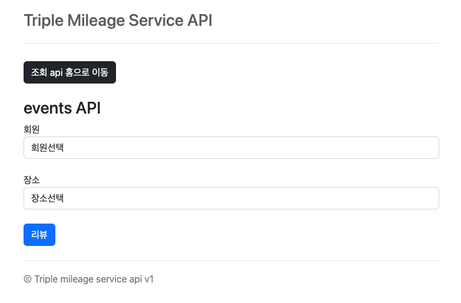
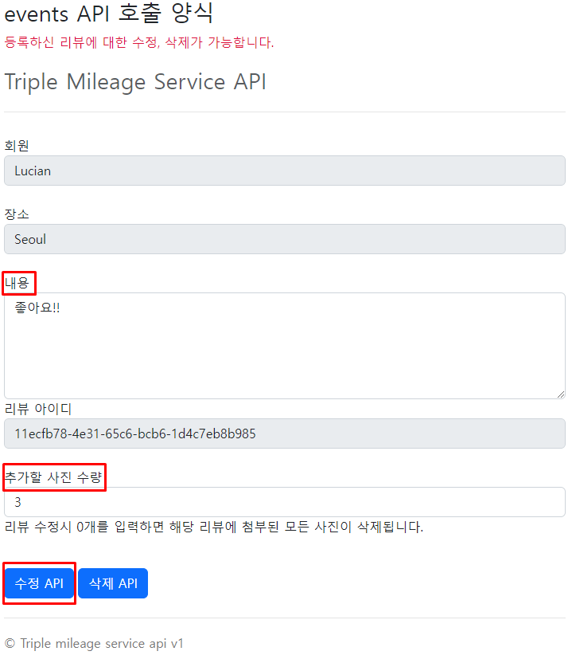

# triple_mileage_service

## 1. Description
    트리플여행자 클럽 마일리지 서비스 API 서버를 개발 했습니다. 
    이를 위해 web 페이지를 개발 하었으며, 해당 web을 통해 API 호출이 가능합니다.
    아래의 화면 순서대로 web을 통해 API 호출 부탁 드려요!

## 2. 애플리케이션 실행 방법
## &#128187; 해당 API 실행 방법 (리눅스)
    # IntelliJ로 실행하는 방법
        * IntelliJ가 설치되어 있다면 프로젝트 파일 열어서 애플리케이션 실행
    # jar 파일을 실행하는 방법
        * IDE에서 해당 API 프로젝트 Gradle > bootJar 실행하여 .jar 파일 생성
        * 리눅스 서버 접속 후 JDK 설치 및 환경변수 셋팅
        * nohup java -jar [jar파일명]& 명령어로 jar 파일 실행
        * kill -9 [pid] 명령어로 실행 종료 (pid = ps -ef | grep java)

## # 리뷰 추가(ADD)
2-1) 애플리케이션이 실행되었다면, 인터넷 브라우저를 열어 ``http://localhost:8070/homeEventsAPI`` 를 주소창에 입력 합니다.

 
* 회원과 장소를 선택하고 `리뷰` 버튼을 클릭 합니다(`회원`과 `장소`에 대한 데이터는 미리 입력이 되어있는 상태 입니다.)

2-2) events API를 호출하는 양식입니다. 내용과 사진 수량을 입력하고 [추가API] 버튼을 클릭하면 `POST` `http://localhost:8070/events` API를 호출하게 됩니다.
    

2-3) API 호출 결과를 보여주는 화면 입니다.   
`**설명 : 리뷰 내용이 1자 이상(+1 포인트), 첨부된 사진 1장 이상(+1 포인트), 해당 장소 첫 리뷰(+1 포인트) >> 총 3 포인트` 

## # 리뷰 수정(MOD)
2-4) `2-1)`의 화면으로 이동하여 방금 등록한 회원, 장소를 선택하고 `리뷰` 버튼을 클릭하면 아래와 같이 수정과 삭제가 가능한 화면으로 이동합니다.

* 내용을 비우고, 사진 수량에 0을 입력한 후 수정 API 버튼을 클릭합니다.   

2-5) API 호출 결과 입니다.  
`**설명 : 내용을 빈값으로 수정(-1 포인트), 사진 수량을 0개로 수정(-1 포인트) >> "2-3)"에서 획득한 3포인트에서 -2 포인트를 하게되어 1포인트만 남게 됩니다.` 

## #리뷰 삭제(DELETE)
2-6) `2-1)`의 화면으로 이동하여 방금 등록한 회원, 장소를 선택하고 `리뷰` 버튼을 클릭하면 아래와 같이 수정과 삭제가 가능한 화면으로 이동합니다.

- `삭제API` 버튼을 클릭 합니다.  

2-7) API 호출 결과 입니다.  
`**설명 : 리뷰를 삭제 하였기 때문에 해당 리뷰로 인해 생긴 모든 포인트를 회수하여 0 포인트가 남게 됩니다.`

## #회원 포인트 조회
2-8) http://localhost:8070/homePointListAPI 주소를 입력하여 회원 조회 API를 호출하는 페이지로 이동합니다.  
`위에서 리뷰를 등록하였다가 수정하고 삭제했던 회원의 정보를 조회 합니다.`

* 회원을 선택하고 `조회하기` 버튼을 클릭합니다.

2-9) API 호출 결과 입니다.  
`**설명 : 위의 회원을 조회하였습니다. 모든 포인트는 회수된 상태이기 때문에 "CANCEL" 값을 갖게 됩니다."`

## 3. API Description
### [3-1] `Post` `/events`
#### &#128073; Request Parameters
|Parameter|     타입     |필수여부|설명
|:---:|:----------:|:---:|:---:|
`type`|   String   |필수| events 타입(REVIEW)
`action`|   String   |필수| 리뷰 Action(ADD:추가, MOD:수정, DELETE:삭제)
`reviewId`|    UUID    |필수| 리뷰 id
`content`|   String   |선택| 리뷰 내용
`attachedPhotoIds`| List`<UUID>` |선택|리뷰에 첨부된 이미지들의 id 배열
`userId`| UUID | 필수 | 리뷰 작성자 id

#### &#128072; Response (success)
    {
        "code": 0,
        "data": {
            "reviewId": "11ecfb6c-500c-3639-ab42-b3206eabbdeb",
            "userId": "11ecfb6c-4bbb-047e-ab42-7b503e6f9936",
            "pointBalance": 3
        },
        "message": "OK"
    }

#### &#128072; Response (error)
    {
        "code": 400,
        "message": "userId 값은 필수 입니다.",
        "data": null
    }

### [3-2] `GET` `/pointListByUserId/{userId}`
#### &#128073; Request Parameters
|Parameter|     타입     |필수여부|설명
|:---:|:----------:|:---:|:---:|
`userId`| UUID | 필수 | 유저 아이디

#### &#128072; Response (success)
    {
        "code": 0,
        "data": {
            "updated_at": "2022-07-04T17:08:04.577",
            "created_at": "2022-07-04T17:07:37.672",
            "userName": "Lucian",
            "userId": "11ecfb70-5e24-781f-af56-4d7df0c9f4c4",
            "point": [
                {
                    "pointAmt": 1,
                    "pointState": "NORMAL",
                    "pointId": "11ecfb70-6e35-ef2b-af56-c718ca2de0e8",
                    "updated_at": "2022-07-04T17:08:04.559",
                    "created_at": "2022-07-04T17:08:04.559",
                    "pointType": "CONTENT_REVIEW",
                    "reviewId": "11ecfb70-6e30-70e5-af56-bd65e1296959"
                },
                {
                    "pointAmt": 1,
                    "pointState": "NORMAL",
                    "pointId": "11ecfb70-6e36-645c-af56-eddd31006b32",
                    "updated_at": "2022-07-04T17:08:04.561",
                    "created_at": "2022-07-04T17:08:04.561",
                    "pointType": "PHOTO_REVIEW",
                    "reviewId": "11ecfb70-6e30-70e5-af56-bd65e1296959"
                },
                {
                    "pointAmt": 1,
                    "pointState": "NORMAL",
                    "pointId": "11ecfb70-6e38-ae4d-af56-731d5278f5c7",
                    "updated_at": "2022-07-04T17:08:04.576",
                    "created_at": "2022-07-04T17:08:04.576",
                    "pointType": "FIRST_REVIEW",
                    "reviewId": "11ecfb70-6e30-70e5-af56-bd65e1296959"
                }
            ]
        },
        "message": "OK"
    }

#### &#128072; Response (error)
    {
        "code": 400,
        "message": "존재하지 않는 회원 입니다.",
        "data": null
    }

## 4. DataBase Schema, DDL, Index, ERD
    4-1) 프로젝트 내의 schema.sql 파일 참고 부탁 드립니다.
         * 경로 : triple_mileage_service\mileageService\src\main\resources\schema.sql
    4-2) ERD
         * 경로 
            - mdj 파일 : triple_mileage_service\triple_mileage_service_erd.mdj
            - 스크린샷 파일 : triple_mileage_service\triple_mileage_service_erd.png